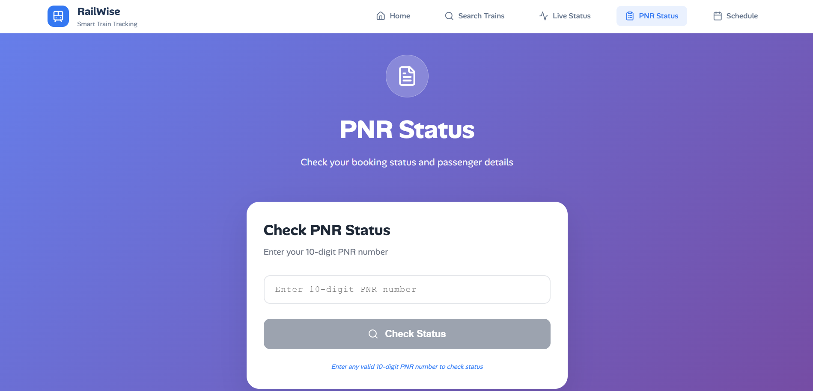

# RailWise

RailWise is a comprehensive railway information platform that provides real-time train tracking, PNR status checking, train search, and schedule information for Indian Railways. Built with a modern React frontend and Express.js backend, it offers a seamless user experience for planning and monitoring railway journeys.

**🌐 Live Demo**: [https://k3railwise.vercel.app/](https://k3railwise.vercel.app/)

## 🚀 Features

- **Real-time Train Tracking**: Monitor live train status and location updates
- **PNR Status Check**: Check your PNR status instantly
- **Train Search**: Find trains between stations with flexible time windows
- **Train Schedule**: View detailed train schedules and routes
- **Responsive Design**: Works seamlessly on desktop and mobile devices
- **Fast API**: Powered by RapidAPI for reliable railway data

## 📸 UI Preview

Here are some screenshots of the RailWise application:





## 🛠️ Tech Stack

### 🎨 Frontend

- **React 19** with TypeScript
- **Vite** for build tooling
- **React Router** for navigation
- **Lucide React** for icons
- **Axios** for API calls

### ⚙️ Backend

- **Express.js** with TypeScript
- **Axios** for external API integration
- **RapidAPI** for IRCTC data
- **MongoDB** for caching RapidAPI responses
- **AWS Lambda** for serverless deployment

### 🏗️ Infrastructure

- **Terraform** for infrastructure as code
- **AWS Lambda** and **API Gateway** for backend deployment

## 📋 Getting Started

### 📋 Prerequisites

- Node.js (v18 or higher)
- npm or yarn
- AWS CLI (for deployment)

### 📦 Installation

1. Clone the repository:

```bash
git clone https://github.com/KodeWithKK/railwise.git
cd rail-wise
```

2. Install client dependencies:

```bash
cd client
npm install
```

3. Install server dependencies:

```bash
cd ../server
npm install
```

### 🔄 Development Workflow

1. Start the backend server:

```bash
cd server
npm run dev
```

The server will run on `http://localhost:3000` (or configured port).

2. Start the frontend development server:

```bash
cd client
npm run dev
```

The client will run on `http://localhost:5173` (default Vite port).

3. Open your browser and navigate to the client URL to use the application.

### 🏭 Building for Production

1. Build the client:

```bash
cd client
npm run build
```

2. Build the server:

```bash
cd server
npm run build
```

## 📡 API Usage

The RailWise API provides endpoints for accessing Indian Railways data. All endpoints return JSON responses.

### 🌐 Base URL

```
http://localhost:3000/api/v1/irctc
```

### 🔗 Endpoints

#### 🔍 Search Trains

**GET** `/search-train`

Search for trains between two stations within a specified time window.

**Query Parameters:**

- `source` (string, required): Source station code
- `destination` (string, required): Destination station code
- `hours` (string, required): Time window in hours

**Example:**

```bash
curl "http://localhost:3000/api/v1/irctc/search-train?source=NDLS&destination=LKO&hours=24"
```

#### 📍 Live Train Status

**GET** `/live-train-status`

Get real-time status of a train.

**Query Parameters:**

- `trainNumber` (string, required): Train number
- `startDay` (string, required): Journey start day

**Example:**

```bash
curl "http://localhost:3000/api/v1/irctc/live-train-status?trainNumber=12512&startDay=1"
```

#### 🎫 PNR Status

**GET** `/pnr-status/{pnr}`

Check the status of a PNR number.

**Path Parameters:**

- `pnr` (string, required): 10-digit PNR number

**Example:**

```bash
curl "http://localhost:3000/api/v1/irctc/pnr-status/1234567890"
```

#### 📅 Train Schedule

**GET** `/train-schedule/{trainNumber}`

Get the complete schedule and route of a train.

**Path Parameters:**

- `trainNumber` (string, required): Train number

**Example:**

```bash
curl "http://localhost:3000/api/v1/irctc/train-schedule/12512"
```

### Response Format

All successful responses return JSON data from the IRCTC API. Error responses follow this format:

```json
{
  "error": "Error message"
}
```

### Error Codes

- `400`: Bad Request (missing required parameters)
- `500`: Internal Server Error (API or server issues)

## 🚀 Deployment Guide

RailWise uses GitHub Actions for automated deployment of the backend to AWS Lambda using Terraform.

### 📋 Prerequisites

- AWS account with appropriate permissions
- MongoDB Atlas or similar for database
- RapidAPI key for IRCTC data
- GitHub repository secrets configured:
  - `AWS_ACCESS_KEY_ID`
  - `AWS_SECRET_ACCESS_KEY`
  - `MONGO_URI`
  - `RAPID_API_KEY`
  - `RAPID_API_HOST`

### ☁️ Backend Deployment

The backend is automatically deployed using GitHub Actions when changes are pushed to the `main` branch affecting the `server/src/` directory.

#### Workflow Triggers

- **Automatic**: On push to `main` branch with changes to `/server/src/**`
- **Manual**: Via GitHub Actions UI (workflow_dispatch)

#### Deployment Steps

1. **Checkout code**
2. **Setup Node.js** (v18)
3. **Install dependencies & Build** the server
4. **Configure AWS credentials**
5. **Setup Terraform** (v1.10.0)
6. **Terraform Init**
7. **Terraform Apply** with auto-approve
8. **Output Lambda URL** for API access

#### Destroying Infrastructure

To destroy the deployed infrastructure, run the "Destroy Express Backend" workflow manually from the GitHub Actions tab.

### 🌐 Frontend Deployment

The frontend can be deployed to any static hosting service:

- **Vercel**: Connect your GitHub repo and deploy automatically
- **Netlify**: Drag and drop the `dist` folder or connect via Git

1. Build the client:

```bash
cd client
npm run build
```

2. Deploy the `dist` folder to your hosting provider.

3. Update API calls to point to the deployed Lambda URL.

### 🔐 Environment Variables

Configure the following secrets in your GitHub repository:

- `MONGO_URI`: Your MongoDB connection string
- `RAPID_API_KEY`: RapidAPI key for IRCTC data
- `RAPID_API_HOST`: RapidAPI host
- `AWS_ACCESS_KEY_ID`: AWS access key
- `AWS_SECRET_ACCESS_KEY`: AWS secret key

## 🤝 Contributing

1. Fork the repository
2. Create a feature branch: `git checkout -b feature/your-feature`
3. Commit your changes: `git commit -am 'Add some feature'`
4. Push to the branch: `git push origin feature/your-feature`
5. Submit a pull request

## ⚠️ Disclaimer

This application uses third-party APIs for railway information. Please ensure compliance with IRCTC terms of service and API usage policies
